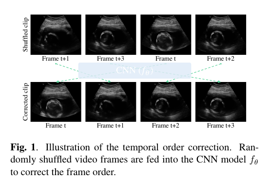
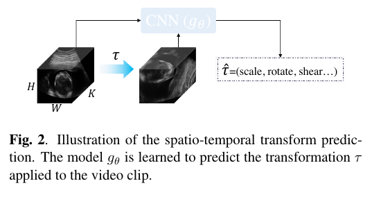

## Super short description
* [Paper Link](https://arxiv.org/abs/2003.00105)
* This paper works on UltraSound (US) video. Focus is to learn anatomically congnizant representation of fetal US video frames in an unsupervised way. To achieve that, they train the network to predict 2 transformations which they introduce in the input video at training time: affine transformation and jumbling the order of frames.

## Concise Overview on central idea and approach taken
As mentioned above, the focus is to learn a representation which captures the anatomy present in US frames. To do that in unsupervised way, they introduce spatial and temporal transformations. To unearth these transformations from the modified input would require the model to have an understanding of the anatomy of the content of US frames.

### Temporal-Order Correction
They use 4 video frames as input. The formulate it as a classification problem with $$4!/2 = 12$$ classes. Note that forward and backward video flow is considered to be same class.

### Spatio-temporal Transform Prediction
They use several affine transformations like rotation, scale, shear etc and train another network to predict the transformation parameters. Note that transformation is applied to all frames.

### Combining above two tasks:
They employ two strategies. In the first strategy, they use two networks with shared weights and train both task parallely. In this strategy, there are two inputs: one having frames reshuffled and one with spatio-temporal transformation.  In the second strategy, they apply modifications sequentialy on the input, feed it to a single network and train it to predict both temporal ordering and affine transformation parameters.
