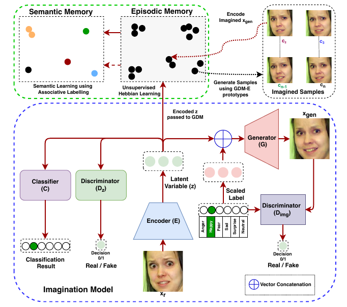

## Super short description
* [Paper Link](https://www.computer.org/csdl/pds/api/csdl/proceedings/download-article/1kecIRr1grK/pdf)
* This paper works on facial expression recognition (6 expressions. For example: anger, happiness etc). Its novelty lies in its Imagination Model: generating new images of same person with different facial expressions from the orignal image. Another interesting portion is the integration of this Imagination model as a data augmentation module to the main model, the GDM module.

## A short Background
* FER : Facial expression recognition
* Dual memory: Episodic and semantic.
* Episodic memory example: David Beckham smiling face in last video. This memory should change pretty rapidly.
* Semantic memory example: A typical european smiling face. This memory should change relatively slowly.
* Continual Learning (CL): Methodology with which the model should improve on getting incremental amount of data with time. Similar to online learning in spirit.
* GDM module: A Continual learning model. Implements the human inspired dual memory system using artifical neurons.
## Understanding the paper
### Imagination model
Model is adapted from ExprGAN. It has two discriminators: $$D_z$$ to regularize the latent space embedding and $$D_{img}$$ to regularize the generated images. $$D_z$$ ensures that latent space embedding of generated images is similar to original image embeddings. This helps to reduce distorting in generated images. $$D_{img}$$ ensures that generated images actually have the intended face expressions.

### How does GDM module ensure rapid non-overlapping learning in Episodic memory
* Non overlapping means that each embedding is attempted to get stored as they are. Tendency to encode the common features across embeddings of same face expression type is discouraged.
* Learning rate is high.
* Its objective is to retain the input to a high degree of precision. It is made quite eager to add new neurons.

### How does GDM module ensure slow overlapping learning in semantic memory
* Learning rate is kept low.
* It has a relatively higher bar for adding a new neurons.
* This model takes as input best representations of face latent embeddings from the episodic memory. It uses mode for fixing the feature prototypes for different expression types.
