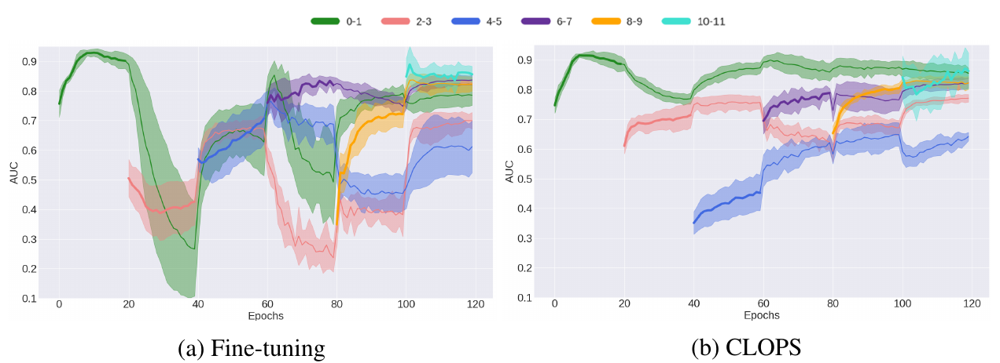

## Super short description
* [Paper Link](https://arxiv.org/abs/2004.09578)
* Broad theme is Continual learning(CL) based setup on medical dataset. Objective is to mitigate the drastic forgetfulness about previous tasks while learning the current task. Novelty of the paper is in the way to create replay buffer and to fetch a subset of data from replay buffer. The paper saves those examples which are most easiest to train for each task. Paper fetches those examples from replay buffer for which the model is getting highly confused.

## Background
### Continual Learning(CL)
In CL setting, there are multiple tasks which are given to the model sequentially. The primary goal is to retain the performance on previously learnt tasks as much as possible while learning to solve new tasks. Naturally, the tasks are related to each other. One can contrue a CL based approach for say price prediction of stocks and bonds by binning the recent history into different tasks. In every such task, the price moves in a slightly different way. In other words there is a covariate shift in the data across tasks.

One popular way to solve it is to have a **replay buffer** where one keeps a subset of training data for each of the previous tasks. This replay buffer is then used to augment the training data for the current task. This is also the approach taken in this paper.

## Summary of paper's methodology
### Data addition in Replay buffer
Paper uses weighted average of individual data point losses. There weights are learnable parameters termed as $$\beta$$ and is defined for every data point of every task. Since individual losses are strictly positive, the weights have a natural inclination to go towards 0 (we are minimizing the loss). Paper prevents this by introducing another loss term which penalizes their distance from 1.  Also, the outliers in the training data (or the examples which are harder to train) would have learnt lower weights thereby reducing their contribution  to the loss. So the examples which are easier to train would have relatively higher weights. Paper takes a fraction of the dataset which has larger averaged $$\beta$$, average taken over epochs. This fraction of the dataset is added to the replay buffer.

### Data retrieval from Replay buffer.
This paper does not use all of the data present in Replay buffer to augment the training. It selects a subset of the data for each learnt task from the Replay buffer. It doesnot use the label information for selecting the data points. It selects those datapoints for which the model currently has gotten most confused about. Note that these datapoints were the easiest learning datapoints for the respective tasks.So the introduced confusion is directly related to forgetfulness of the model towards previously learnt tasks.
>This confusion or the uncertainty is captured by estimating the entropy in the posterior distribution of labels with the help of dropout.

In naive terms, they pass the input through the network multiple times. Due to dropout, the predicted probablity distribution over labels is different in each forward pass.They estimate the fluctuation in the probablity distribution. Larger the fluctuation, more confused is the model.

In above figure, one can look at the performance of CLOPS. The new task learning begins after every 20 epochs. Task which is getting learnt has a bold line. Shaded area represents the one standard deviation. It is evident that CLOPS has  lesser average detoriation on already learnt tasks when a new task is being learnt. It also has lesser fluctuation around the mean for already learnt tasks (from shaded area comparison).
