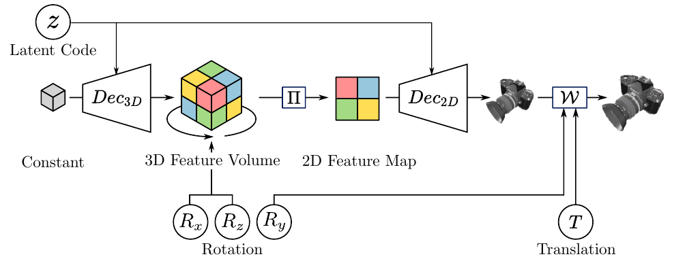
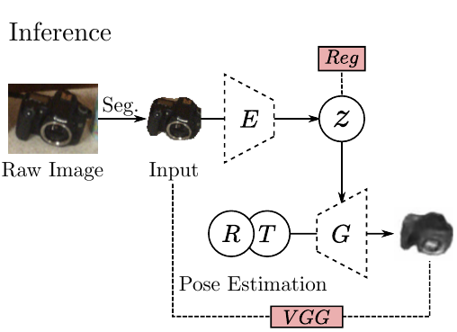

## Super short description
* [Paper Link](https://arxiv.org/abs/2008.08145)
* Pose estimation problem is tackled here. Firstly, a generative module is trained to generate images by taking input image embedding and its 6D pose. At evaluation time, input image embedding is passed through the generative module  to yield an image. With the objective to make generated image identical to input image , using gradient descent, the input pose and shape are iteratively updated. Besides the model architecture, other highlight of the paper is its good performance despite not using either a CAD model or depth information for the reference object.

## A concise overview on approach taken
### Pose-aware Image Generator

This module takes input the image embedding a.k.a the latent code and 6D pose vector and aims to output the same object in a different orientation as defined by the pose vector. It has four steps:
1. 3D feature volume is generated from latent code.
2. Out of plane rotation is applied on the 3D feature volume. This in a way disentangles geometry from appearance. By applying desired out of plane rotations on 3D feature volume, 3D feature volume  is encouraged to contain just appearance based info.
3. Rotated 3D feature volume is then projected into 2D space.
4. Generating the image from 2D feature map. At this point, translation and in-plane rotation as defined in the 6D pose vector is applied on the generated image.

### Object pose estimation

This requires the generation module to be trained. Generation module is trained in Variational autoencoder fashion with latent variable being the image latent code. This module takes as input an image and uses trained image generation module to estimate its pose and latent code. Idea is to feed the generation module some latent code and pose and get a generated image. Use gradient descent iteratively to bring generated image as close to input image by minimizing the perceptual loss and thereby updating the latent code and the pose. Note that Generation module's weights are fixed for this task. They do this whole process multiple times, starting with a different latent code and pose each time. Among several predictions, they pick the one with the least final perceptual loss. Using trained encoder and the input image, they fetch the mean and variance of the gaussian distribution modeling the latent code and sample from that. They sample pose uniformly from the space of valid poses.
