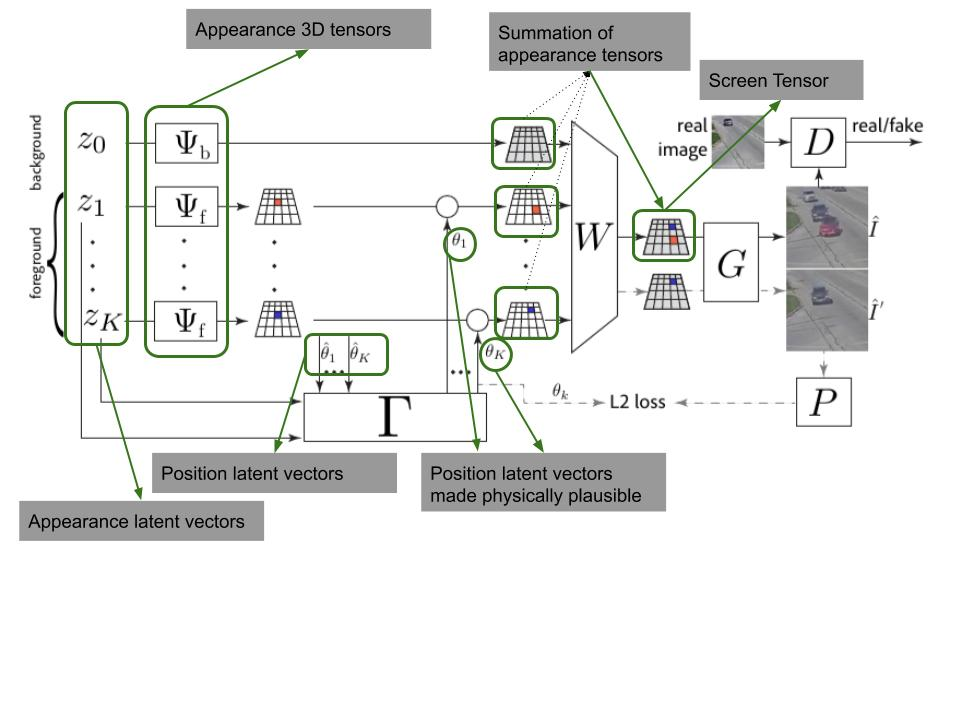

## Super short description
* [Paper Link](https://arxiv.org/abs/2007.01272)
* This paper does unsupervised scene generation using GAN based setup. Major novelty here is that they are able to enforce real world relationships between objects and also between objects and background. (eg: A generated ball should be inside the generated bowl). It does so by handling object identity  and its position separately. It is able to extend this approach in temporal dimension so as to generate videos.

## Understanding the paper
A GAN takes input a latent vector and generate images. In several GAN variations, the latent vector is trained to have a semantic component. In this work, the latent vector is created in a specific way. It has been empirically shown that one can configure number as well as type of objects one wants in the scene. One can also decide upon the type of background.
The model takes care of the acceptable relationship between objects and between objects and background.

Model architecture has two modules. First one is Scene composition and rendering module. Firstly, this is responsible for generating latent vectors to decide upon number of objects, kind of background and kind of each object. This is also responsible for generating latent vectors for position of each object. Paper calls these two latent vector sets as appearance and position vectors. All these vectors are generated independently. This module also converts the appearance vectors to 3 dimensional tensors.

For ensuring that objects obtain 'sensible' positions in the scene, the appearance and position vectors are passed through interaction module. Output of the interaction module are rectified position vectors. These position vectors are then 'applied' on the 3 dimensional (appearance) tensors. Finally screen tensor is computed which is the sum of appearance tensors rectified with positions for background and for individual objects. Screen tensor is passed to GAN as input
