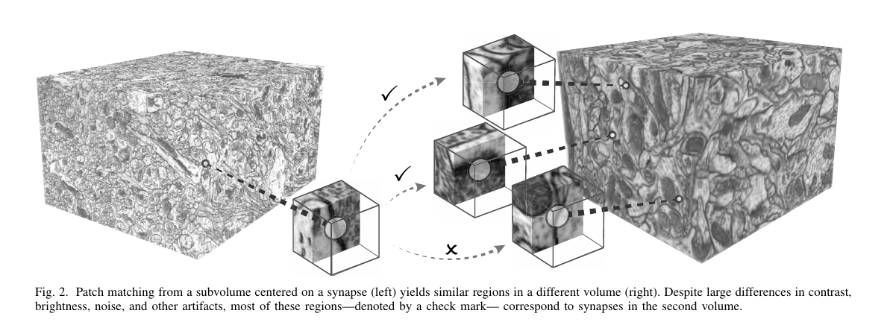
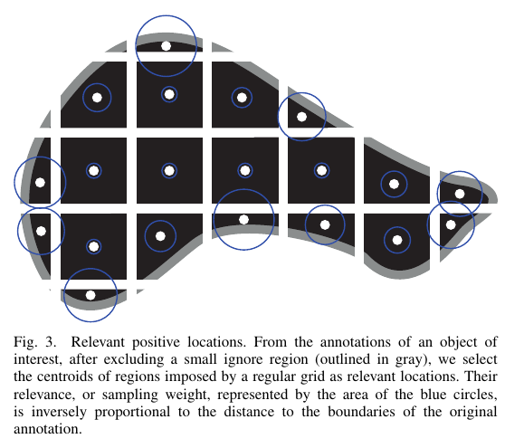

## Super Short Introduction
* [Paper Link](https://ieeexplore.ieee.org/document/8863400)
* It is aimed towards better domain adaptation in segmenting Electron Microscopy images. Highlight of the paper is that it works with unlabeled target domain images. Paper establishes visual correspondences between labelled images (source domain) and unlabelled images of target domain. Using the pixel correspondence and labelling of pixels of source domain images, paper generates noisy labels for target domain image pixels. Paper builds two approaches using these correspondences. In the first, using Multiple Instance Learning, the paper uses these noisy labels to adapt to target domain. In the second approach, paper aggregates the correspondences on target domain images to get something like a heatmap which it shows to be quite similar to actual annotations. The map is then used in domain adaptation and yields superior performance in general over the first method.

## Brief Summary of Main Ideas
### Few Definitions
* Source domain: Set of images for which we have labelled annotations.
* Target domain: Set of images for which we just have images. We don't have annotations or labels. The aim of the paper is to do well on this set.
* Labels: In a given domain (source or target), there is a single class. So, for each pixel, a binary label is used denoting whether the pixel belongs to the background or the foreground (belongs to an instantiation of that class).
* NCC: Normalized cross correlation. It is the metric which is used to compute similarity between voxels for establishing correspondences.
### Establishing Correspondences
* Few +ve and -ve voxels are sampled from source domain. This procedure is described in the next heading.
* For each voxel, a surrounding patch is taken. Using NCC, a similarity score is computed between the patch and every voxel in the target domain image. This is done repeatedly done for different orientations of the patch and highest similarity measure for each target domain location is retained.
* Some of the correspondences are removed by doing non-maximum suppression. Those which have lower NCC value are also removed.
> In this way, for every sampled voxel from source domain, there is a set of corresponding voxels in the target domain.

<figure>
    
    <figcaption>Establishing Correspondences (Credits: https://ieeexplore.ieee.org/document/8863400).</figcaption>
</figure>

### Sampling Intelligently from Source Domain
#### What is done
* Volume is divided into samed sized patches by defining a grid. Centroid of each patch is a candidate for sampling.
* Different methodology for sampling from Foreground and from background regions.
* Foreground region sampling: More sampling done from border regions of the target structures.
* Background region sampling: It has two components. In the first, more sampling is done from border regions of the target structures. In the second, those background voxels are also selected which give high NCC score with positive voxels.
<figure>
    
    <figcaption>Division of the region into patches  (Credits: https://ieeexplore.ieee.org/document/8863400).</figcaption>
</figure>

#### Why it is done
* Two nearby voxels would have overlapping patches which would be inefficient sampling. Therefore the grid is constructed and only centroids could get sampled.
* To better discriminate between foreground and background, information is required on how the texture and pattern changes at the boundary and so boundary regions are preferred.
* Sampling confusing voxels from background would improve model's stability.

### Multiple Instance Learning (MIL)
* For doing domain adaptation, paper learns a new set of weights for the new domain. This is achieved through MIL.
* Huber loss ensures that large differences are given relatively less importance.
* *softmin* computes the loss between a source domain voxel and all its correspondences in the target domain. This one to many aspect in the loss makes this a MIL setting. It is designed to ignore large differing correspondences. It is so as $$exp^{-r*x_i}$$ goes to 0 pretty quickly when the x_i large.

### Consensus Heatmaps
Idea is to aggregate the correspondences over all the sampled voxels of source domain to generate a heatmap on target domain volume. This heatmap is claimed to be a more robust source of information for foreground and background regions. NCC score and the shape of the annotation of the corresponding voxel on source domain volume are the two things which are used for its creation.
They form this heatmap in two ways.
* Gaussian Mixture Model: For every source voxel, the distribution of location of correspondence in target volume is modelled using GMM. Mean parameters are the location of detected correspondence points. Covariance matrix is based on the shape of the annotation of the source domain voxel and the best orientation.
* Label Driven Model: For every target domain correspondence point, there may be multiple source domain points which corresponds to it. This model first aggregates the annotation of each such source domain point by taking into account the orientation. Thresholding and normalizing it yields a mask. All correspondences which lie outside the mask are ignored.
