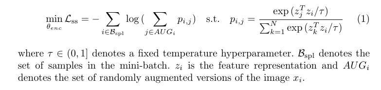
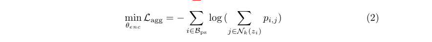

## Super Short Description
* [Paper Link](https://arxiv.org/abs/2010.09856)
*  This paper does unsupervised anomaly detection using clustering based approach using an autoencoder network. Paper is able to extract prototypical representations of training data in embedding space in a clustered way. Anomaly score is obtained in the embedding space by comparing test embedding with closest prototypical representations from training data. The crux of the paper lies in its different loss components and use of memory bank for time efficiency.

## Brief Overview of the Methodology

### An Intuition on Entropy
More narrow sharp peaks in the probablity distribution leads to lower entropy. Here, entropy is computed on embedding space and paper aims to minimize it. A sharp peak around a location in embedding space means that lots of images in training data map to that location in the embedding space. This is what leads to clustering.

### Reconstruction Loss
Paper uses an auto-encoder network and therefore naturally uses a MSE based $$L_{mse}$$ reconstruction loss. Note that without this loss, all images will learn to map to a single location in embedding space thereby making the entropy component of loss 0. This component ensures that embedding contains most of instance specific information.

### Sample Specific Loss (for augumentation invariance)
This is applied on embedding space (output of the encoder). This ensures that augumented versions of the same image have very similar embedding representation. This is achieved by minimizing the entropy in the following way
<figure>
    
    <figcaption> Sample specific loss (Credits: https://arxiv.org/abs/2010.09856).</figcaption>
</figure>
For some intuition, note that for minimizing $$L_{ss}$$ with fixed individual $$z_i, z_k$$, we need to maximize $$z_j^Tz_i$$ which would happen when both $$z_i,z_j$$ are very close to each other. So this loss encourages that.

Training happens in two phases. In the first pre-training phase, the network is trained using $$L_{mse} + L_{ss}$$. In the second phase, another component $$L_{agg}$$ is added which ensures that clustering of similar training images happens in the embedding space.

### Memory Bank
Embedding of all examples in training data is saved in this array like structure. Updation is done in a moving average way. This is helpful to get top-k similar embeddings from the training data needed in the $$L_{agg}$$ described in next section.
<figure class="half">
    
    
    <figcaption>Memory Bank</figcaption>
</figure>
### Aggregation Loss (for clustering)
It is very similar to how $$L_{ss}$$ works. The difference is that dot product in $$p_{i,j}$$ is computed between embeddings of two similar looking but different images.

<figure>
    
    <figcaption> Aggregation loss (Credits: https://arxiv.org/abs/2010.09856).</figcaption>
</figure>

Here, $$N_k(z_i)$$ denote the top-k neighbors of $$z_i$$ from memory bank. Picking the top-k encourages the model to make the embedding vector $$z_i$$ very similar to its k neighboring embedding vectors. This leads to progressive clustering.
