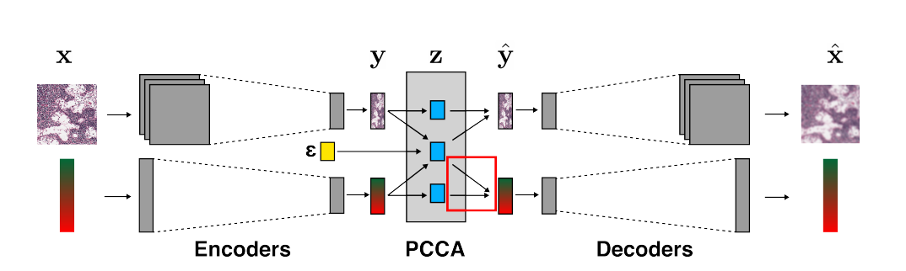

## Super Short Description
* [Paper Link](http://auai.org/uai2019/proceedings/papers/340.pdf)
* This paper aims to develop a connection between two modalities : medical image features (tissue image) and the state of the cell (gene expression levels). For each modality they have  a latent space representation. Model is trained in a way to maximise the correlation between the two latent space representations. To this end PCCA (probablistic CCA) is used. To encorporate non-linear features, neural network embeddings are used. Model is trained in an end-to-end fashion with encoder-decoder architecture.

## Brief Overview of the Methodology
### Definitions
* CCA (Cannonical Correlation Analysis): Input is two mean centered vectors. CCA projects both input vectors into a shared sub-space. It does so by learning a linear (matrix multiplication) operation. The matrix parameters are learned such that there is maximal correlation between the two input vectors in their shared sub-space.
* PCCA (Probablistic CCA): In this case, modality specific variations are also modelled besides modelling the shared information between the two input vectors.
>Note that, an encoder-decoder structure is better off with PCCA when compared with just CCA. With PCCA, the dominant modality specific features also get expression in modality specific components.

In CCA, they have to be ignored since only shared information is captured.

### Encoder & Decoder
For both encoder and decoder, two different types are used for the two modalities. A CNN based architecture is used for imagees where as a single dense layer is used for gene expressions.

### Data flow
The two inputs (image and the gene expression) are passed through their respective encoders to get embeddings. The outputs are subsequently passed on the PPCA module where one gets two modality specific components and one shared component. Using them, the emeddings are first reconstructed. The reconstructed embeddings are then passed to their respective decoders to yeild reconstructed inputs. The flow is shown in the figure below.
<figure>
    
    <figcaption>Proposed Architecture (Credits: http://auai.org/uai2019/proceedings/papers/340.pdf).</figcaption>
</figure>
