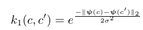
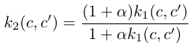
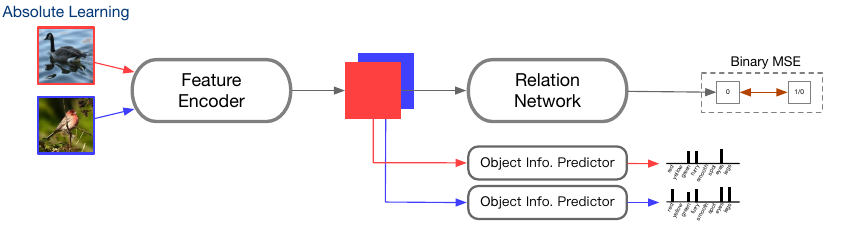
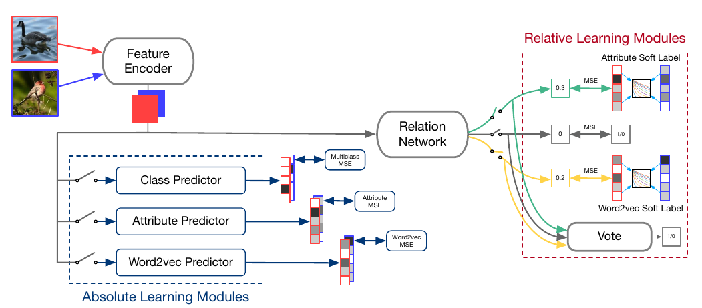

## Super Short Description
* [Paper Link](https://arxiv.org/abs/2001.03919)
* This paper is about improving the feature representation which consequently improves the classification performance on multiple datasets under K-shot learning paradigm. They have two components in their architecture: one of them learns to find similarity between pair of images and the other explicitly learns to capture the properties of classes. For similarity module, they use semantic embedding (Word2Vec and feature_attributes) so as to move to soft labels from 0-1 binary similarity. For Absolute module, they explicitly predict semantic embeddings along with class labels using parallel network branches built on top of their feature encoder. This setup enables feature encoder to encoder better representation.

## A Concise Overview on Approach Taken
### Similarity Network
It consists of two subnetworks: a feature encoder which yields embeddings from input image and the relation network which yields the similarity score between two input image embeddings. Mathematically, relation network input-output is described as following:
$$ SI(\phi,\phi^*; P) = r(v(\phi,\phi^*);P)$$. Here, $$\phi,\phi*$$ are the feature embeddings of two images, v represents the concatenation operator and r denotes the relation network.

### Relative Learning
Relative learning builds on Similarity network. Difference lies in the target. Unlike in most similarity networks, here, the target is not boolean but soft. They first obtain a semantic embedding for the two classes belonging to the two input images. wordVec and feature_attributes are two variations tried for the class semantic embedding. They then employ a similarity measure on the embedding to yield a real valued similarity, which works as 'soft' similarity.

<figure class="half">
    
    
    <figcaption> Two similarity measures. Credits: https://arxiv.org/abs/2001.03919.</figcaption>
</figure>

### Absolute Learning
An Object info predictor branch is attached on top of feature encoder which predicts semantic embeddings (wordVec and attributes). Note that semantic embedding along with similarity measure was used in Relative learning to make the relation labels soft. Another thing to note here is that target of Relation network is binary and not soft. Authors integrate these two components in next section. Interestingly, for the binary target, MSE is used.

### Absolute-Relative Learning
As can be seen below, all components mentioned above have been integrated into one network which is jointly learnt. We have a soft-labelled relation network which uses wordToVec, attributes and class labels to estimate similarity separately and subsequently use a voting procedure to yield final prediction. We then have 3 absolute learning branches predicting wordToVec, attributes and class labels.

