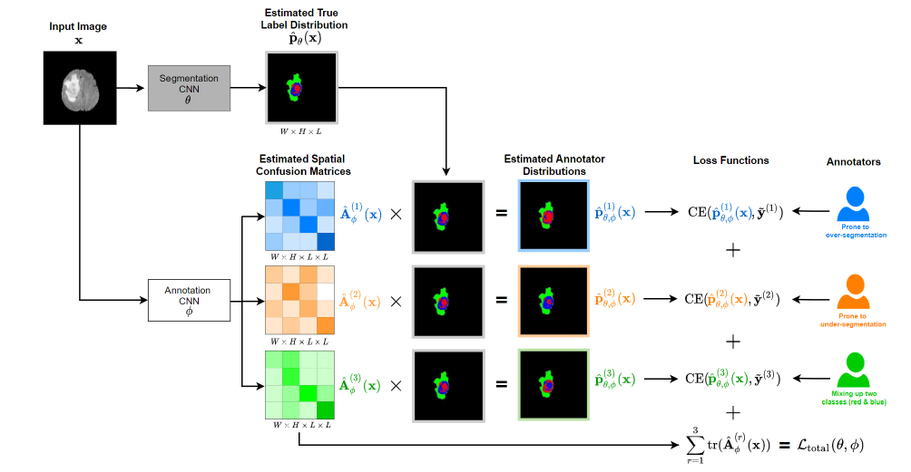

## Super Short Description
* [Paper Link](https://proceedings.neurips.cc/paper/2020/file/b5d17ed2b502da15aa727af0d51508d6-Paper.pdf)
*  This work is on segmentation of medical images. Novelty is that it learns to take into account the errors made by individual annotators. Specifically, given an input image, the paper is able to predict two things jointly: the true segmentation probablity distribution and what each annotator would segment. Annotator specific segmentation probablity distribution is generated by predicting the confusion matrix for each pixel and for each annotator. Another novelty is the non-intuitive theoretically proven loss component which is crucial for this disentanglement of predicted segmentation probablity distribution from predicted spatial confusion matrix. This component minimizes the trace of the confusion matrices.

## Brief Overview of the Methodology
### Notations and Definitions
* Annotator specific spatial confusion matrix ($$A^{(r)}_{\phi}$$): For annotator r, this is a confusion matrix for each pixel in the input image over $$L$$ target labels.
* Estimated True label distribution ($$\hat{p}_{\theta}(x)$$): For every pixel, it contains the probablity distribution over labels.
* Estimated Annotator distribution ($$\hat{p}^{(r)}_{\theta}(x)$$): If estimator $$r$$ had to segment the image $$x$$, then he/she would estimate $$\hat{p}^{(r)}_{\theta}(x)$$ as the per-pixel true probablity distribution over labels.
* Segmentation CNN: CNN network which predicts $$\hat{p}_{\theta}(x)$$ and takes MRI image as input.
* Annotation CNN: CNN network which predicts $$A^{(r)}_{\phi}$$ and takes as input a MRI image.

### Architecture Description
* Input: An MRI image $$x$$.
* Output: 1. $$\hat{p}_{\theta}(x)$$, 2. $$A^{(r)}_{\phi} ~\forall r $$.
* Flow: $$x$$ is passed through the Segmentation CNN to yield segmentation probablities $$\hat{p}_{\theta}(x)$$. At inference time, this is the final prediction. $$x$$ is also passed through Annotation CNN to get $$A^{(r)}_{\phi}$$ for each annotator $$r$$. Using the confusion matrix and the label distribution, using matrix multiplication, it is straight forward to compute estimated annotator distribution: the label distribution as the annotator $$r$$ would have felt ($$\hat{p}^{(r)}_{\theta}(x)$$). At training time, the loss is computed using them and not using $$\hat{p}_{\theta}(x)$$. It makes sense becase in the training data, we donot have true label distribution. We only have labels annotated by specific annotators.
<figure>
    
    <figcaption> Overall Architecture description (Credits: https://proceedings.neurips.cc/paper/2020/file/b5d17ed2b502da15aa727af0d51508d6-Paper.pdf).</figcaption>
</figure>

### Loss Components
It has two components.
* The first component aims to minimize the difference between estimated annotator distribution and ground truth annotator distribution. This is done for each annotator.
* The second component aims to minimize the trace of spatial confusion matrix for all annotators. Paper claims that this component leads to separation of annotation noise from true label distribution. Paper proposes a theorem for it. The theorem assumes that the estimated annotator distribution is identical to actual annotator distribution. It also assumes that both the actual and the predicted confusion matrices are diagonally dominant on average. Both assumptions are plausible which is explained below:
1. First assumption is plausible as the CNN based models generally achieve very low errors.
2. Second assumption concerning actual confusion matrices is plausible since the annotators are trained persons and therefore they make few mistakes.
3. Third assumption concerning estimated confusion matrices is plausible by construction. For the first few epochs, trace is forced to increase.
> Minimum value of trace of average of spatial confusion matrices is achieved when the estimated spatial confusion matrix becomes equal to the actual spatial confusion matrix for each annotator. So, miniminzing the trace in the loss moves the predicted spatial confusion matrices towards their ground truth counterparts.

With estimated spatial confusion matrices close to their ground truth counterparts and estimated annotator distribution close to ground truth annotator distribution, estimated true label distribution naturally gets closer to actual true label distribution.
