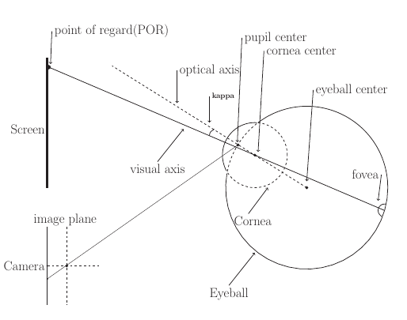
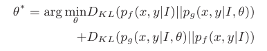

## Super short introduction
* [Paper Link](https://dl.acm.org/doi/10.1145/2857491.2857515)
* Novelty of the paper is its personal calibration procedure using Saliency maps. Here, a CNN based architecture is used to predict saliency maps- probablity of being looked given a image patch. For gaze estimation, regression based model is created for 2D gaze and a model-based analytical modelling is done for 3D gaze. Using the predicted gazes by the gaze model, paper models another version of saliency map by using gaussian mixture models with their mean set to the predicted PoRs (location on the image). Paper is able to estimate parameters of the gaze model by minimizing the KL divergence between the two saliency map distributions.

## An Overview of the Methodology
### Notations:
* PoRs: Point of regard. In case of 3D gaze estimation, PoR is the intersection of image plane with the visual axis. In simple terms, it is the point on the image screen where the person is looking at.
* x,y: Co-ordinate of a pixel on the screen (which has the image I ).

### Eye Fixation Map (Saliency map) Estimation using RCNN
RCNN architecture comprises of CNN module followed by dense layers. Output of dense layers is regressed to yield a scalar denoting the probablity of input region being looked at. It is trained with a center bias - region closer to center of the image has more probability of being looked at.

### Eye Gaze Estimation
Eye gaze estimation is formulated for both 2D as well as 3D case. For 2D case, regression based approach is taken. Gaze position is modelled to be simply the linear combination of feature vectors, feature vectors being the pupil glint vector. For 3D case, standard eye model is used (assuming the eye as sphere). In this case, the unknown parameter is the angle between visual axis and the optical axis.

### Distribution based Calibration
We get the eye fixation map using RCNN ($$p_f(x,y\|I)$$) and using the gaze estimation model ($$p_g(x,y\|I,\theta)$$). For estimating the parameters of the gaze model, the paper minimizes the KL-divergence between these two fixation maps.

