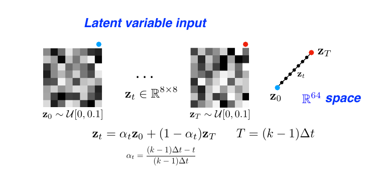
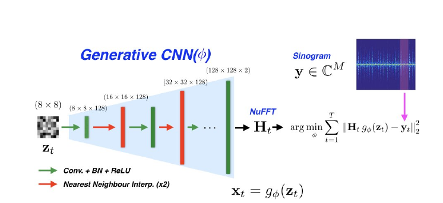

## Super Short Description
* [Paper Link](https://arxiv.org/abs/1910.01684)
*  This work is about generating 2D MRI image temporal sequence from sinograms. The interesting part is that the approach is unsupervised, a generative model is used and piecewise linear interpolation in GAN's input latent space maps to temporal interpolation in the image space.

## Brief Overview of the Methodology
### Initial Points to Note
* In  Dynamic MRI, the image which is being scanned changes with time. So the objective is to recover $$x_t$$ at time $$t$$.
* Actual input to the model is golden angle radial lines. However, using NuFFT, it is converted to sinograms.
* For every new MRI sequence reconstruction, the model needs to be retrained from scratch.

### Training Procedure
* Two latent variables $$z_0$$ and $$z_T$$ (64 dimensional) are sampled from a uniform distribution. They correspond to start time 0 and end time $$T$$ of the sequence to be predicted. For any intermediate time $$t$$, the latent variable is obtained by a simple linear interpolation.
>$$z_t = \alpha_tz_0 + (1-\alpha_t)z_T$$
<figure>
    
    <figcaption> Interpolation of latent variable (Credits: https://arxiv.org/abs/1910.01684).</figcaption>
</figure>

* The latent variable $$z_t$$ is fed to a deep CNN model which outputs MRI image $$x_t$$ at time $$t$$. Note that information regarding the temporal aspect is only present in the latent variable. CNN model is jointly optimized over all time points. Thus, CNN model just by itself does not know for which timestamp does it need to generate the MRI image.

* Similar to what gets done to actual MRI image, output of CNN model is operated upon using NuFFT. This converts it to an estimate of sinogram. As we have the actual sinogram data for different time points, this procedure is used to train the CNN model so that the predicted sinogram gets maximally close to target sinogram.

<figure>
    
    <figcaption> Overall Architecture (Credits: https://arxiv.org/abs/1910.01684).</figcaption>
</figure>

* Once the training is done, MRI image at time $$t$$ is obtained by feeding $$z_t$$ as input to the CNN model.

