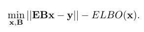

## Super short description
* [Paper Link](https://arxiv.org/abs/2007.13123)
* This paper works on MRI images. Idea is to use undersampling while taking MRI thereby speeding up the MRI process and subsequently using deep learning to faithfully reconstruct the scans to high dimension. Novelty here is its claimed ability to maintain reconstruction quality even with domain shifts arising due to hardware variations.

## Overview of the adopted approach
### Nomenclature:
1. $$x$$: True MRI image. This is the target.
2. $$y$$: undersampled data.
3. Relationship between $$y$$ and $$x$$: $$y = Ex + \eta$$

### Methodology
1. They first train a Variational autoencoder on true MRI images patches (on $$x$$). ELBO of an estimate $$x^t$$ computed on this trained VAE would be an indicator of how 'real' does this estimate look like.
2. They state bias field as something which fluctuates the pixel intensity. They introduce a pixelwise multiplier $$B$$ which explicitly models the bias field thereby decoupling it with the content. Both $$B$$ and the estimate $$x$$ are obtained using the following equation:

$$Bx$$ is the predicted estimate.

3. For doing the above mentioned optimization, they follow an iterative approach where they move the estimatealong the direction of gradient of ELBO. This will necessarily make sure that the ELBO score increases and therefore the 'naturalness' of the estimate increases. This transformation is named as Prior projection ($$P_{prior}$$)
4. However, this process may change the content of the the estimate. Therefore they compute how much deviation has occured in the estimate from $$y$$ and then subtract out that deviation from the estimate. They name it as data consistency projection $$(P_{DC})$$. They also briefly mention another projection named as phase projection which they directly take from another paper.
