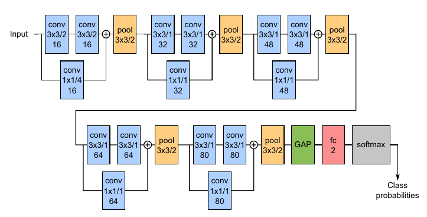

## Super Short Introduction
* [Paper Link](https://www.nature.com/articles/s41598-019-42557-4)
* This paper proposes a CNN network tailored for using X-Ray dataset to predict Tuberculosis. Highlights of the paper is its super small architecture, small training data but comparable performance w.r.t other approaches. Another highlight is intuitive visualization specially with saliency map which is helpful for medical professionals.

## Overview of Main Ideas
### Definitions
* Saliency Map: Derivative of output class score w.r.t input image. It has the same resolution as the input image. It shows relative importance of input pixels in the decision making.
* grad-CAMs: Derivative of output class score w.r.t a feature map from a deeper layer. It has lower resolution than input image but has better localization.
### Network Structure
Architecture is relatively simple and is shown below. $$a * b/c$$ format is used in multiple blocks shown below where a and be are the spatial kernel dimensions and c is the stride. $$\bigoplus$$ means addition and GAP is global average pooling.
<figure>
    
    <figcaption>Proposed Architecture (Credits: https://www.nature.com/articles/s41598-019-42557-4).</figcaption>
</figure>

One interesting this about this architecture is the higher stride (4) in the first block. Paper notes that performance did not degrade when stride was increased from 2 to 4. Paper suggests that this may be due to the fact that it is easier to compute simple features like edges (which is what first few layers do) and so strided convolutions did not degrade the performance.

### Visualization
Paper showed that Saliency maps were visually quite intuitive (one of the authors is expert in inspection of X-ray
images). Lower resolution in case of grad-CAMs made them less useful. Motivation for this is to give the clinician
another piece of information besides the classification prediction. As seen below, it is easy to agree with the paper
that the saliency maps have important visual queues which the clinicians would understand.
<figure>
    
    <figcaption> Saliency map overlayed on original X-ray scan. This example has TB and the model correctly predicted it. (Credits: https://www.nature.com/articles/s41598-019-42557-4).</figcaption>
</figure>

