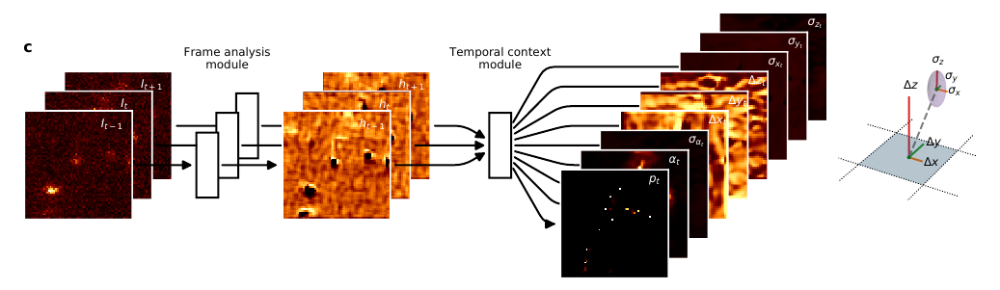

## Super Short Introduction
* [Paper Link](https://arxiv.org/abs/1907.00770)
* It is related to single-molecule localization fluorescence microscopy. This paper proposes a novel architecture named DECODE to simultaneously detect and localise fluorophores. In terms of performance, the work significantly outperforms other approaches on all 12 applicable datasets from SMLM2016 challenge. In terms of ideas, firstly they use the temporal information. Secondly, they provide uncertainty estimates for flurophore detection, localization and brightness. Thirdly, for training the model, they introduce Combined Learning which combines Simulator Learning(learning from simulated data) and Variational Auto Encoder learning (using real images).

## Summary of Main Ideas
### Input-Output Setting of the Proposed Network
* Input: A sequence of image frames ($$ImageCount=3$$) containing sparsely activated fluorophores.
* Output: For each pixel location in the input frames, it predicts
    1. the probablity of it having a fluorophore,
    2. x,y and z component relative to center of the pixel denoting its location,
    3. its brightness,
    4. the uncertainty estimates in brightness estimation and localization estimation.

    This prediction is delivered by the model by giving output an 8 channel feature map having the same spatial dimensions as the input frames.

### DECODE network overview
It has two submodules. Frame analysis module takes as input one frame and it predicts the feature embeddings. Temporal Context Module takes in these feature embeddings and predict the 8 channel feature maps which is the network's output.
<figure>
    
    <figcaption>Proposed Architecture (Credits: https://arxiv.org/abs/1907.00770).</figcaption>
</figure>

### Simulator Learning
From existing literature, the process by which presence of flurophores (our target) give rise to detected image(input to this architecture) is well known. Using randomness to set the independent parameters, a synthetic data was created on which the network was trained. This has also been done in past approaches.

### Loss Formulation
Since the paper predicts the mean as well as the standard deviation of properties of interest (location and brightness), this allows them to formulate the loss using Gaussian mixture of models. Naturally, they maximize the likelihood of ground truth positions (generated from simulated data).

### Auto Encoder learning
As stated above, the process (forward model) by which the flurophores get converted into the image (which is the input of this system) is known. However, the parameters of the process may not be aligned with real situations. This is where this auto encoder learning helps. Given an input sequence of frames (real data generated from actual fluorophores), DECODE is used to predict the location and brightnes parameters. This is fed into the forward model to generate an image.By minimizing the difference between generated image and the input image, the setup learns the parameters of both DECODE and the forward model. This ensures that DECODE is using a forward model which is aligned with real situation. This is not the case in Simulator Learning as there the parameters of the forward model are arbitrarily fixed.
