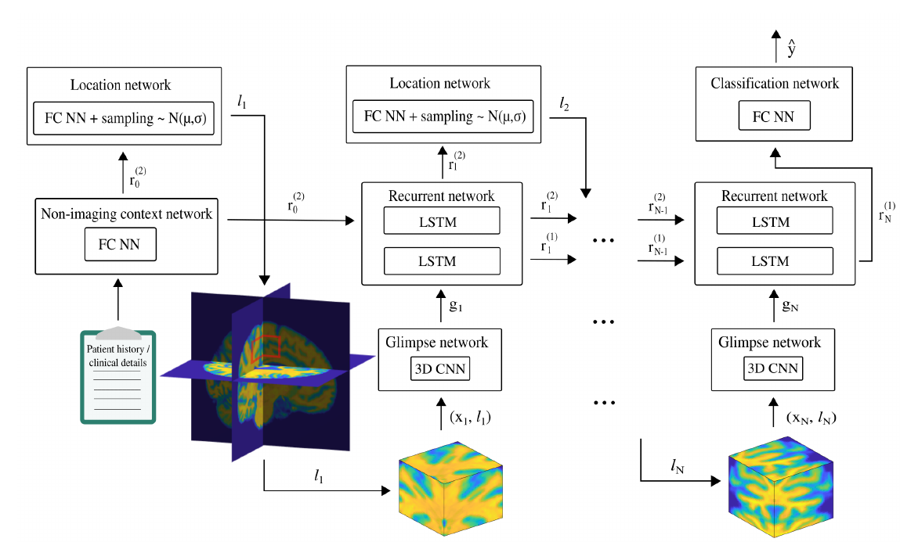

## Super Short Introduction
* [Paper Link](https://arxiv.org/pdf/1910.04721.pdf)
It works on 3D MRI data of human brain primarily for prediction of Alzheimer disease. Novelty of the paper is more generalizability, more interpretebility and faster training time, all due to its novel architectural design. A RL agent is trained to find small 3D volumes of interest from which feature are generated which are subsequently assimilated with LSTM. Additionally, it naturally supports other forms of non-imaging input information by incorporating them as LSTM's initial state.

## Brief Description of Main Ideas
<figure>
    
    <figcaption>Proposed Architecture (Credits: https://arxiv.org/pdf/1910.04721.pdf).</figcaption>
</figure>

### Glimpse Network
* Input: Location vector $$l_t$$ generated by Location Network and a glimpse $$x_t$$ (a small 3D volume) around the location.
* Output: A vector $$g_t$$ representing what has been seen and where it has been seen.
* Internals: $$x_t$$ is passed through a 3D CNN to yield $$g_{x,t}$$. $$l_t$$ is passed through a fully connected layer to yield $$g_{l,t}$$. The output $$g_t$$ is the element wise multiplication of the two above mentioned intermediates.
>$$g_t = g_{x,t}\bigodot g_{l,t}$$

### Recurrent Network
* Input($$(t +1)^{th}$$ step): $$g_t$$, the output of glimpse network. The output of the context netowrk is taken as input in the first step as $$r_0$$.
* Output($$(t +1)^{th}$$ step): $$r^{t+1}$$ which has the assimilated information from looking at $$\{x_0,..x_t\}$$
* Internals: This network assimilates information from all seen glimpses till that point in time.

### Other Sub-Networks
* Location network is a single fully connected network giving output a 3D vector $$\mu_t$$. The location $$l_{t+1}$$ is sampled from a gaussian distribution with $$\mu_t$$ as mean. This randomness improves generalization.
* Non-imaging context network takes as input non image based input and generates a representation which gets fed to the Recurrent network.
* Classification network is a single layer fully connected NN with sigmoid activation. Output from the recurrent network is fed to this network as input for predicting the probablity of Alzheimer disease. By not using the output of the Non-imaging context netowrk directly as input, it ensures that MRI data is used as the primary source of knowledge and other data more like a 'supplimentary info'.

### RL Agent Configuration
* Input($$(t +1)^{th}$$ step): a new glimpse $$x_t$$ and a scalar reward $$r_t$$. $$r_t$$ is set to 1 for all timesteps if the classification was done correctly. Otherwise, it is set to 0.

### Training
Since they have the classification labels , Classification and Glimpse network parameters (can be and therefore) are trained in a supervised fashion. Sampling the location introduces a discontinuity and so the initials components comprising of Location and Context network are trained via reinforcement learning.

