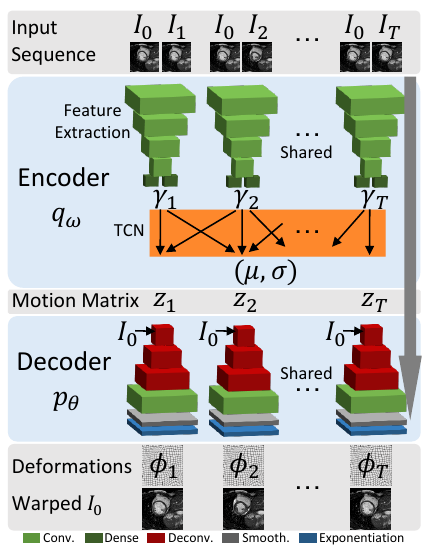

## Super Short Description
* [Paper Link](https://arxiv.org/pdf/2011.01741.pdf)
* Given a sequence of images, this paper learns to predict a motion model. It predicts warping parameters for each element in the sequence. Simply stated, when the first image of the sequence is warped with say predicted warping parameters of $$5^{th}$$ element, then $$5^{th}$$ image of the sequence should get formed. It uses conditional VAE for this. For having a non-fluctuating motion model, a temporal convolutional network is used. For making the model capable of generating consistant warping parameters for missing images in the sequence, temporal dropout is introduced in training. Further, the paper also shows the capability of transport: applying the motion of one object on another.

## Brief Overview of the Methodology
### Encoder
Encoder consists of a feature extraction module and a Temporal Convolutional Network (TCN). An image pair is passed to the feature extractor to get a latent representation. Each element of the input sequence is coupled with the first element of the sequence to create image pairs. The latent representation encodes the relative motion between the two frames. TCN comprises of 1D convolutions. The latent representations are convolved with TCN so as to achieve temporal regularization. The output $$(\mu,\sigma)$$ is the mean and the standard deviation of the posterior distribution. Motion matrix $$z$$ is sampled from the posterior.
### Decoder
Decoder takes as input the motion matrix and the first image of the input sequence and generate the deformations (warping parameters) for each element in the sequence. They are then applied on the first image of the input sequence to get generated images. The aim of the paper is that these generated images should closely match the images from the input sequence (starting from the second image).

<figure>
    
    <figcaption>Proposed Architecture (Credits: https://arxiv.org/pdf/2011.01741.pdf).</figcaption>
</figure>

### Generating Missing Images in the Input Sequence.
A zero vector is taken as the output of the feature extractor for those images in the sequence which are absent. One needs to appreciate the TCN, since  it is TCN which still is able to provide a meaningful posterior mean and standard deviation comprising all elements of the sequence. Additionally, temporal dropout in the training procedure also helped the model to do such things. In temporal dropout, some of the feature representations were intentionally left out randomly during training. This forced the model to learn to interpolate for the missing element.

### Transport
It flows naturally from the structure of the model. The motion matrix $$z$$ of one object is taken and is fed to the decoder with the first image of the input sequence for another object.
