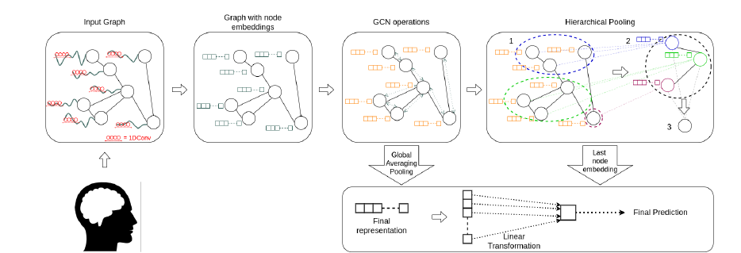

## Super short description
* [Paper Link](https://ieeexplore.ieee.org/document/9175360)
* Technical domain is Geometric Deep Learning and its application is on fMRI (brain) data. They present a methodology of incorporating spatial relationships between brain regions with the temporal variations in fMRI data of different brain regions. They show its effectiveness on a binary classification task of predicting sex from brain data.

## Brief Overview of Workings of the Paper
### Conventions and nomenclatures:
1. Different brain regions are termed as nodes (count: $$N$$).
2. Input data is $$ N * T $$ where $$T$$, denoting the timeseries length, is 1200.
3. Neighbourhood information: Dense adjacency matrix ($$N*N$$). Their architecture also can handle sparse neighbourhood information.

### Step by step procedure:
1. *Temporal feature extraction:* For each node, they use module composed of 1D CNN to extract features from the temporal data. Output is termed as Activation matrix ($$H(1)$$). Input output relationship: $$N*T => N*256$$
2. *GCN Operations:* Message passing is used to incorporate the information in the activation matrix from neighboriing nodes' activation matrices. Activation matrix's shape remains the same. Input output relationship: $$N*256 => N*256$$

3. For feature aggregation over multiple nodes, two methods are used. Simpler one is the average pooling across nodes. Input output relationship: $$N*256 => 1*256$$
2. *Hierarchical Pooling:* The other method used is Differential pooling which is taken from a different paper. The procedure runs in multiple iterations. At each iteration, it clusters nodes present in previous iteration into a smaller number of clusters. This way, at the end one is left with just one node. While the final output dimension is same as Average pooling, in this procedure one has effectively given different weights to different nodes and this has been achieved in a hierarchical
way. Input output relationship: $$N*256 => 1*256$$

