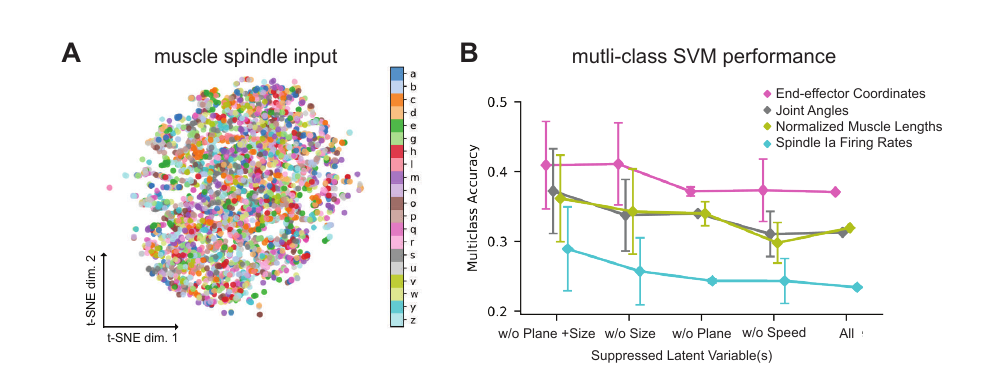
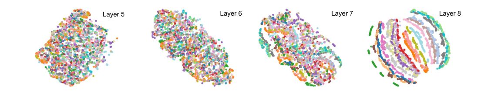

## Super Short Description
* [Paper Link](https://www.biorxiv.org/content/10.1101/2020.05.06.081372v1)
*  Broad goal of the paper is to model the proprioceptive system. Specifically, the work aims to classify what has be written by hand using spindle (present in hand muscles) firing rates. It creates a synthetic dataset on which the study is done.  Classification target set is 20 english characters. Using multiple existing models, an existing pen-tip trajectories data is converted into  muscle length configurations data which is inturn converted into spindle firing rates. Activations of intermediate layers of trained neural network show similarity with experimental findings thereby lending credebility to the fact that the created model is indeed somewhat similar to the actual proprioceptive system.

## Brief Overview of the Methodology
### Definitions
* Proprioceptive Pathway: This pathway is responsible for sensing the state of the body. It receives information from receptors. Here, we deal with an important receptor type namebly muscle spindles. Since our body knows how our fingers are from muscle spindle data, the motivation is to create a ANN (Artificial neural network) model which does the same.

### Dataset Creation
They start with a dataset of pen-tip trajectories. This data maps a pen-tip trajectory to a character. Here, they use multiple data augmentation techniques on the trajectory (scaling, rotating, shearing, changing the speed) to generate more data. Assuming some initial posture of human upper limb, joint-angle trajectories were computed using optimiziation. Also, the letter was placed in differet planes in the 3D space so as to have more variety in the angle trajectories.  A model of human upper limb is used to get equilibrium muscle lengths for 25 muscles from the joint-angle trajectories. Finally, another pre-existing model is used to convert the muscle length configuration to spindle firing rates.

### Challenging Task
A t-SNE plot of spindle firing rates show that one cannot visually discriminative different characters. Low performance of SVM trained on spindle firing rates also support the claim.
<figure>
    
    <figcaption> Challenging Task to classify characters from spindle firing rates (Credits: https://www.biorxiv.org/content/10.1101/2020.05.06.081372v1).</figcaption>
</figure>

### Neural Network models.
Two family of models were developed. The first family is called spatial-temporal. Note that different muscle spindles is the spatial dimension and then there is a time component to it. In Spatial-temporal family, there is sequential processing of information across  spatial dimension and temporal dimension. They use one dimensional kernels to process information along one dimension at a time. The second family, called spatiotemporal, uses two dimensional kernels and therefore process information across both dimension simultaneously.
<figure>
    
    <figcaption> One observes discrimnative representation with ANN (Credits: https://www.biorxiv.org/content/10.1101/2020.05.06.081372v1).</figcaption>
</figure>

### Few Interesting observations.
1. Character identity was represented in distributed way. It was not that a single node in last layer of ANN was completely responsible for the prediction for some character.
2. Similar to biological proprioceptive pathway, direction tuning was found in ANN. Interestingly, it was even found in the un-optimized networks. However, invariance of directional tuning (to non-relevant variables) was only found in trained networks.
