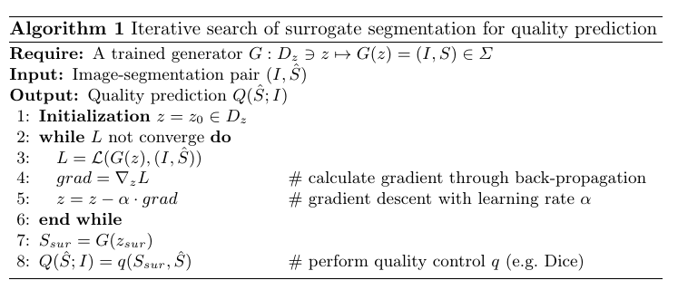

## Super Short Introduction
* [Paper Link](https://arxiv.org/pdf/2006.13379.pdf)
* Given an MRI image and its segmentation, the paper's focus is to obtain a measure denoting quality of the segmentation. Paper uses VAE for first learning (by synthesis) what good segmentation looks like. Afterwards, given an image and its segmentation, the paper projects the segmentation and image pair onto a space of 'good quality manifolds'. A measure of difference between the obtained 'good quality' segmentation-image pair and the input segmentation-image pair is the paper's final output denoting how good the input segmentation was.

## Brief Description of Main Ideas
### Good-Quality Manifold
The paper first learns what a good quality manifold is. Set of image and ground truth segmentation tuples constitutes the good quality manifold. A VAE takes in as input an image $$I$$ and its ground truth segmentation $$S_{gt}$$ and learns to generate it back. Decoder $$G$$ of the trained VAE can generate both image and its segmentation given the latent vector $$z$$ generated by VAE's encoder.

### Iterative-Search in the Latent Space
Paper aims to find a latent vector $$z_{sur}$$ which, when passed through the generator $$G$$ yields a good quality image-segmentation pair $$X$$ ($$X=(I,S)$$). For doing that it uses the fact that since VAE has been trained on good quality image-segmentation pairs, the reconstruction loss for such a pair would be low. Paper first gets an initial latent vector $$z_0$$ by passing the input (I,S) through VAE's encoder. Main idea now is to find a latent vector $$z_{sur}$$ near to $$z_0$$ which has a lower loss. Paper finds such a latent vector using gradient of the reconstruction loss in an iterative fashion. The iteration stops when then loss plateaus around some value.  Paper indirectly shows that this latent vector indeed generates good quality image-segmentation pair by demonstrating the effectiveness of the quality control done using this method.
<figure>
    
    <figcaption>Iterative Approach (Credits: https://arxiv.org/pdf/2006.13379.pdf).</figcaption>
</figure>
