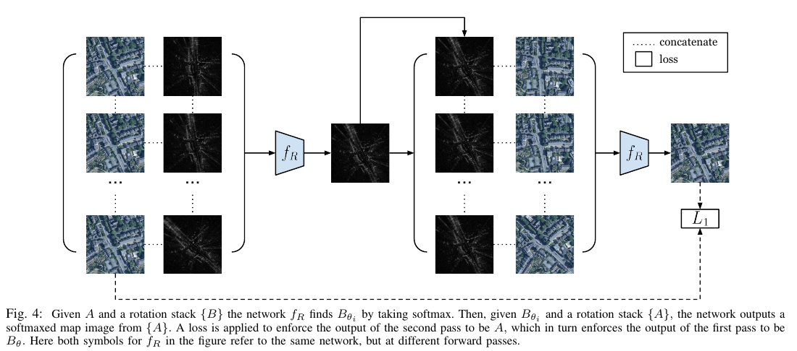
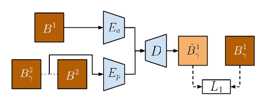

## Super short description
* [Paper Link](https://arxiv.org/abs/2006.02108)
* The goal is to pixelwise align image generated from live range sensor (radar/lidar) data with the overhead satellite image. Rotation angle and translation offset in x and y direction are the target to be predicted. Following previous work, the paper finds the rotation angle first and then finds the x,y translations. Key contribution is the unsupervised methodology for both angle and translation estimation.

## Summary of paper's methodology
As mentioned in the description above, the goal here to predict the rotation angle $$\theta$$ and the translation vector $$\alpha$$ which, when applied on the range sensor generated image, would align it with the given satellite image.
Here, we will call range sensor generated image as modality B and satellite image as modality A

### Estimating $$\theta$$
They build on a previous work. There, a deep network $$f_R$$ was used. Let $$I_A$$ and $$I_B$$ denote the image of modality A and B respectively. A number of rotated versions of $$I_B$$ were made. Each version was then concatenated with $$I_A$$. All this was given input to the network. The network generated a weighted average of rotated $$I_B$$ images with largest weight being expected to be given to the correctly rotated version.

Note that in this paper, they don't know the correct rotation angle. They came up with a method involving two passes through the network $$f_R$$. First pass is identical to what is mentioned above. Lets call the output of first pass as
$$I_{B\theta}$$. For the second pass, they make several rotated versions of the $$I_A$$ instead and club it together with $$I_{B\theta}$$. This$ time, they predict weighted average of rotated $$I_A$$ images. Target for the output of the second pass is made to be $$I_A$$. This makes sense intuitively. If $$f_R$$ is trained correctly, then for $$I_{B\theta}$$, A is the aligned satellite image. It can be inferred as $$I_{B\theta}$$ is the output of the first pass. Therefore $$I_A$$ should be predicted in the second pass.

### Estimating $$\alpha$$: PASED module
For this task, input is $$I_A$$ and $$I_{B\theta}$$ generated from the previous module. These two images are rotationally aligned and only the translation offset needs to be found.

For doing that, they needed following modules:
1. $$E_a$$: Encoder network to encode the appearance and content of $$I_{B\theta}$$
2. $$E_p$$: Encoder network to encode the pose ($$\alpha$$) between two translationally variants of $$I_{B\theta}$$
3. $$D$$: Decoder network which generates an image of modality B by taking appearance and pose latent vectors as input.
4. $$E_p^*$$: Encoder network to encode the pose ($$\alpha$$) between  $$I_{B\theta}$$ and $$I_A$$

They train it in two phases. In the first phase, they train $$E_a$$,$$E_p$$ and $$D$$.
> For training $$E_a$$,$$E_p$$ and $$D$$, they capture pose from a pair of translationally differing images and apply the inferred pose on another image.

Let $$B^1,B^2$$ be images from the domain $$B\theta$$. They randomly pick a translation offset $$\gamma$$. They get the appearance of $$B^1$$ as $$E_a(B^1)$$. They get the embedding for $$\gamma$$ as $$E_p(B^2,B^2_{\gamma})$$. Here, $$B^2_{\gamma}$$ is the translated version of $$B^2$$. Feeding above two appearance and pose embeddings in D, they train it end to end to get $$B^1_{\gamma}$$.

They use the trained $$E_a$$,$$E_p$$ and $$D$$ to train $$E_p^*$$ in the second step.
> For training $$E_p^*$$ in an unsupervised fashion, which is equivalent to estimating the translational offset $$\alpha$$  across different modalities,they utilize the additive property of the translation: Composition of two translations is equivalent in effect to a single translation with $$\alpha$$ being the vector addition of the previous two $${\alpha}s$$.
