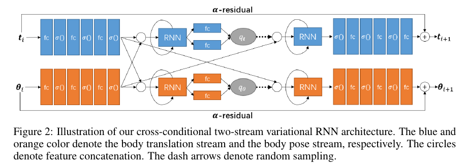
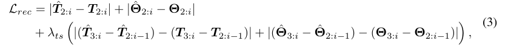
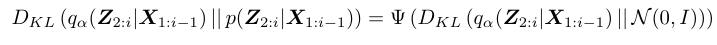

## Super short description
* [Paper Link](https://arxiv.org/abs/2007.13886)
* This paper generates long sequences of human motion. Novelty here is its ability to predict long sequences (72K frames) by taking input very few sequences. In terms of a high level understanding, body pose and overall body translation feeds into each other thereby attaining the required correspondence between them which makes the predicted motion look natural. Technically, two-stream Variational autoencoders are used alongside RNNs.

## Brief Overview of Workings of the Paper

### Human Motion Representation
Paper defines human motion in terms of two more basic concepts. First is Human pose which in naive english translates to how the different parts of the person are oriented and positioned with respect to each other. Second is the Body Translation which naturally means the displacement of person as a whole.
Technical description of their representation is noted below:
1. Human Pose ($$\theta_i$$): SMPL kinematic tree is used. It has 22 joints with each having 6 DOF. Pose therefore is 132 sized vector.
2. Body Translation ($$t_i$$): 3D pelvis location is used.

### Architecture

Architecture is depicted in figure shown above. Few notable points:
1. There are 2 auto-encoder networks, one for pose and one for body translation.
2. Output of last fc layer is the predicted change. $$\alpha$$-weighted average of this along with original state is done to yield next state.
3. Use of RNN in encoder ensures proper modelling of the posterior model $$ q_{\alpha}(Z_{2:i}\|X_{1:i-1}) $$. It is so as at the time of predicting $$Z_i$$, the $$i^{th}$$ time step latent variable,  RNN already has seen $$X_{1:i-1}$$ $$(==\{x_1,x_2..,x_{i-1}\})$$ in previous time steps
4. Similarly, use of RNN in generator ensures proper modelling of the generation model $$p_{\beta}(x_i\|Z_{2:i},X_{1:i-1})$$

### Loss
Their loss $$L$$ is weighed sum of three components:
1. Reconstruction Loss $$L_{rec}$$: It is shown in figure below. To understand the last term, note that if prediction is exactly target, then  $$\theta_{3:i} - (\hat{\theta_{3:i}} - \hat{\theta_{2:i-1}})$$  should be equal to $$\theta_{2:i-1}$$. This is exactly what the term enforces.

2. Pose naturalness loss $$L_{vp}$$: A pre-trained model is used to estimate 'un-naturalness' of the generated body pose which is then minimized in the loss.
3. The KL-Divergence loss $$L_{kl}$$: In the image describing this component below, $$\Psi$$ is the interesting piece. $$\Psi(s) = \sqrt{1 + s^2}$$. They show that due to introduction of $$\Psi$$, this component has temporal components.

