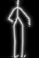
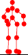
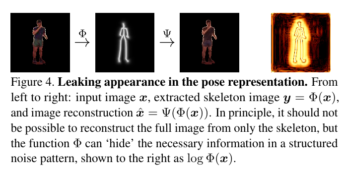

## Super short introduction
* [Paper Link](https://www.robots.ox.ac.uk/~vgg/publications/2020/Jakab20/jakab20.pdf)
* Novelty of the paper is its ability to estimate pose from a single image. Another novelty of the paper is that it is unsupervised and it learns from unlabelled videos. It makes a crucial observation that in image to image translation networks, appearance information seeps into the pose representation and it discritizes the pose to handle that.

## Brief Overview of the Approach Taken
### Definitions
Pose: Pose is defined in two ways: as a skeleton image and as a set of 2D points. Pose is defined for a face image and for whole body as well.

* Skeletal Image Representation of Pose 

* Keypoint Representation of Pose. 

### Encoder
Encoder is an image to image translation network $$\Phi$$ which takes input a video frame image and outputs pictorial representation of pose image.

### Discriminator
The unsupervised approach necessitates the use of Discriminator. This module is trained to discriminate the skeletal image generated by the encoder $$\Phi$$ and the 'true' skeletal images obtained from images. Note that there is no one to one correspondence between image and its ground truth skeletal image. Discriminator makes sure that  skeletal images distribution generated by $$\Phi$$ gets similar to true skeletal image distribution.

### Dual Representation of Pose
As defined in Definitions, pose is defined in two ways. The first definition is its repsentation as the skeleton image. Paper argues that the appearance information is still present in this representation in the form of structured noise. Evidence is that one is able to do the reconstruction of the original image from the pose image. Another evidence is that one is able to visually see the appearnce information if one applies $$log()$$ on the pose representation. It is shown in figure below. It is due to these reasons that, they come up with a discrete Keypoint representation which consists of simply 2D keypoints.

### Conditional Decoder
This module takes input the skeletal representation of pose and an input image containing the pose's object. Note that the pose of the object in the input image is different from the input pose. This module then 'applies' the input pose on the input image thereby generating a new image which has the object in that specific pose which was given as input.
Another point to note is that this skeletal representation of pose is derieved analytically from the keypoint representation of pose. Keypoint representation of the pose is inturn derieved analytically from output of the encoder.
