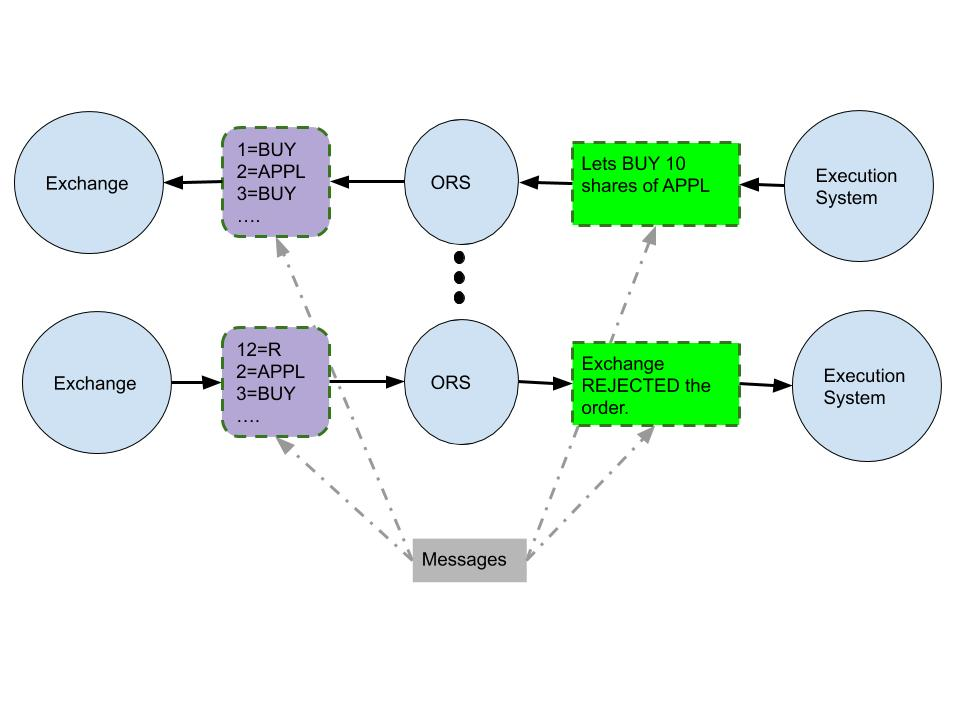

## Just Facts (Like a proficient NLP bot)
I learnt a lot in Software development and Algorithm development.
Software Development: (ORS, ExecutionSimulation, ReconciliationPipeline, PorfolioSimulation)
Algorithms.
Machine Learning

## Humane Touch
### Execution System

### Order Routing Server (ORS)
Exchange speaks a different language. Trading system speaks another. ORS is the interpreter which receives messages from
one and translates it to the other. A buy order request, sell order request, order price modification request etc are
some examples of messages which Trading system sends to Exchange. Order confirmation notification, order cancellation
notification etc. are few examples of messages sent by the exchange.

<h4>ORS</h4>

    

        

        
        

    

## How Market Simulators Work
